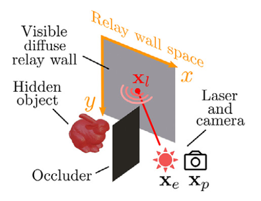

# Examples

* `transient`: Examples on how to render images using Mitsuba 3 (for more info on Mitsuba 3 [watch this](https://www.youtube.com/watch?v=LCsjK6Cbv6Q) or [read the docs](https://mitsuba.readthedocs.io/en/latest/)), and how to render the same scene in transient state or steady state.
* `transient-nlos`: Example on how to render NLOS simulations from the Python interface. For easier setups you can also check [tal](https://github.com/diegoroyo/tal), a Python library with a shell interface that simplifies this process.

## Transient-NLOS

To create a scene and simulate a NLOS setup, you will need to set up the following components:



From here you have two alternatives:

* Configure the XML/Python code of the scene youself, using the help below
* Use https://github.com/diegoroyo/tal. `tal` is a toolkit that allows you to create and simulate NLOS scenes with an easier shell interface instead of directly from XML/Python.

Here's a list of the required plugins and configuration in your scene:

* **Relay wall:** The relay wall must be defined using a rectangle shape with ID "relay_wall" i.e. `<shape type="rectangle" id="relay_wall">`
    * **Camera:** Inside this shape, you must place a `nlos_capture_meter` plugin, which will focus your camera towards a set of points in the relay wall. In order to configure the `nlos_capture_meter`, read [its documentation](https://github.com/diegoroyo/mitransient/blob/57db9075685ccdb0b6aa8af393e234508d90f6b6/mitransient/sensors/nloscapturemeter.py#L16).
* **Laser/light source:** You must define an active illumination emitter that has the ID "laser". You can use the existing `projector` plugin with a low enough `fov` parameter. **In order to point the laser to the relay wall, we recommend using our helper functions instead of using the `transform` plugin. In our example, we only define the `translate` part of the `transform`:**
    ```xml
    <emitter type="projector" id="laser">
        <transform name="to_world">
            <translate x="-0.5" y="0.0" z="0.25"/>
        </transform>
        <rgb name="irradiance" value="1.0, 1.0, 1.0"/>
        <float name="fov" value="0.2"/>
    </emitter>
    ```
    * **Pointing the laser source to the relay wall:** You can use our helper functions for this purpose. We offer three alternatives:
        * `mitransient.nlos.focus_emitter_at_relay_wall_3dpoint(target, relay_wall, emitter)`: Accepts a `mi.Point3f` with the XYZ coordinates on the relay wall where the laser should be pointed at.
        * `mitransient.nlos.focus_emitter_at_relay_wall_uv(uv, relay_wall, emitter)`: Accepts a `mi.Point2f` with the UV coordinates of the shape that you used as relay wall (e.g. if your relay wall is a rectangle, passing `mi.Point2f(0.5, 0.5)` will point the laser at the center)
        * `mitransient.nlos.focus_emitter_at_relay_wall_pixel(pixel, relay_wall, emitter)`: Accepts a `mi.Point2f` with the pixel coordinates (e.g. if you capture a grid of 3x3 points with your `nlos_capture_meter`, passing `mi.Point2f(1, 1)` will point the laser at the center of the center pixel)
        * Note that you need to pass the `relay_wall` and `emitter` parameters, which should be the shapes with ID "relay_wall" and "laser". See the examples Jupyter notebook for more information.
* **Hidden object and occluders:** You can add other shapes in the locations that you want with no restrictions.
* **Integrator:** We provide a `transient_nlos_path` plugin which implements a path-tracing algorithm with specific techniques which work better in NLOS setups. We strongly recommend that you read [the documentation](https://github.com/diegoroyo/mitransient/blob/57db9075685ccdb0b6aa8af393e234508d90f6b6/mitransient/integrators/transientnlospath.py#L14) and [our paper](https://doi.org/10.1016/j.cag.2022.07.003) for further information.